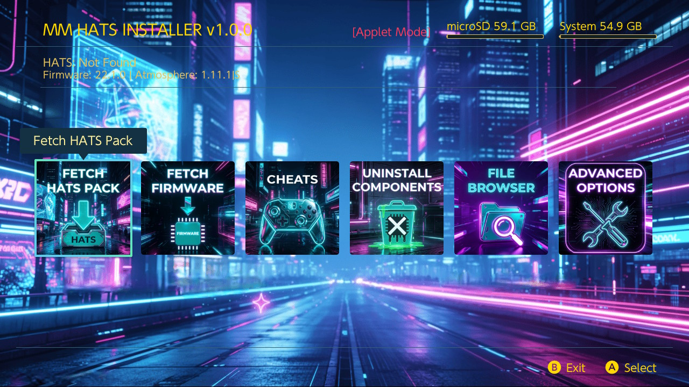

# MM HATS INSTALLER

  

Custom HATS installer for Magic Monkei. 

- **Fetch HATS Pack** - Download and install HATS pack releases
- **Fetch Firmware** - Download firmware for installation via Daybreak
- **Uninstall Components** - Remove installed components (except Atmosphere/Hekate)
- **File Browser** - Browse, manage, and extract files on your SD card
- **Cheats Manager** - Download and manage game cheats from multiple sources

## Installation

1. **Download MM HATS INSTALLER**: Download the latest `MM-HATS-INSTALLER` zip from the releases page
2. **Extract to SD Card**: Extract the zip file directly to the root of your Nintendo Switch SD card
3. The package includes the installer payload at `/switch/mm-tools/hats-installer.bin`.

The app installs to `/switch/mm-tools/mm-tools.nro` and stores config/cache files under `/config/mm-tools`.
The default theme includes the neon city background at `romfs:/theme/mm_background.jpg`.

## Features

### Cheats Manager
The cheats manager provides a comprehensive solution for managing game cheats on your Switch:

- **Multiple Sources**: Download cheats from CheatSlips and nx-cheats-db (local database)
- **View Installed Cheats**: Browse all games with cheats currently installed on your system
- **Cheat Preview**: Preview cheat codes before downloading them
- **Easy Management**: Delete individual cheat files or view detailed cheat information
- **Automatic Detection**: Automatically detects installed games and their build IDs
- **CheatSlips Integration**: Login support for CheatSlips to access premium cheat content

### Automatic Backup
Before installing a HATS pack, the tool can automatically back up your existing `/atmosphere` and `/bootloader` folders to `/sdbackup/` with timestamps (e.g., `/sdbackup/atmosphere_20231225_143000`). This feature can be toggled in the Advanced Options menu.

### Backup Warning
A red warning popup reminds you to backup your SD card before installation. This reminder can be disabled in Advanced Options if you prefer.

