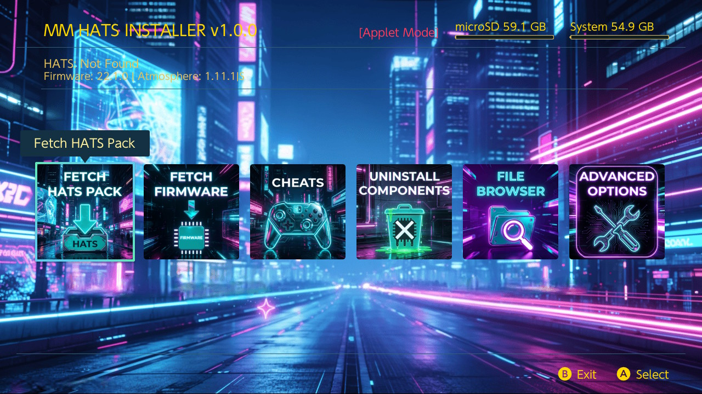

# MM HATS INSTALLER v2.0

  

Custom HATS installer for Magic Monkei. 

- **Fetch HATS Pack** - Download and install HATS pack releases
- **Fetch Firmware** - Download firmware for installation via Daybreak
- **Uninstall Components** - Remove installed components (except Atmosphere/Hekate)
- **File Browser** - Browse, manage, and extract files on your SD card
- **Cheats Manager** - Download and manage game cheats from multiple sources

## Installation

1. **Download MM HATS INSTALLER**: Download the latest `MM-HATS-INSTALLER` zip from the releases page
2. **Extract to SD Card**: Extract the zip file directly to the root of your Nintendo Switch SD card
3. The package includes the installer payload at `/switch/mm-tools/hats-installer.bin`.

The app installs to `/switch/mm-tools/mm-tools.nro` and stores config/cache files under `/config/mm-tools`.

MM HATS INSTALLER checks the latest release on GitHub when it starts. If a newer release is available, it prompts to download the full package ZIP. The ZIP contains `switch/mm-tools/mm-tools.nro` and `switch/mm-tools/hats-installer.bin`; the app extracts and validates its own NRO, replaces the installed copy, and offers to restart into the updated version.

## Windows and macOS apps

- [Download HATS Installer for Windows x64](https://github.com/TechRepairs4U/MM-HATS-INSTALLER/releases/download/hats-installer/HATS-Installer-Windows.x64.exe)
- [Download HATS Installer for macOS](https://github.com/TechRepairs4U/MM-HATS-INSTALLER/releases/download/hats-installer/HATS-Installer.dmg)

Boot your Switch into Hekate, then go to **Tools > USB Tools > SD Card** and connect the Switch to your PC or Mac. Run the desktop app; it will show the Switch drive. Choose the HATS version at the top and click **Start**.

The HATS versions explain what they contain. `HATS.mm+fw` includes the HATS pack and the latest firmware (22.5.0); use Daybreak to install the firmware afterward. If you are already on the latest firmware, use `HATS.mm`. The minimalistic version is the stock Atmosphere-style option without Hekate themes or splash screens.

## Features

### Cheats Manager
The cheats manager provides a comprehensive solution for managing game cheats on your Switch:

- **Multiple Sources**: Download cheats from CheatSlips and nx-cheats-db (local database)
- **View Installed Cheats**: Browse all games with cheats currently installed on your system
- **Cheat Preview**: Preview cheat codes before downloading them
- **Easy Management**: Delete individual cheat files or view detailed cheat information
- **Automatic Detection**: Automatically detects installed games and their build IDs
- **CheatSlips Integration**: Login support for CheatSlips to access premium cheat content

### Automatic Backup
Before installing a HATS pack, the tool can automatically back up your existing `/atmosphere` and `/bootloader` folders to `/sdbackup/` with timestamps (e.g., `/sdbackup/atmosphere_20231225_143000`). This feature can be toggled in the Advanced Options menu.

### Backup Warning
A red warning popup reminds you to backup your SD card before installation. This reminder can be disabled in Advanced Options if you prefer.

### Windows Updater

Make sure to use Hekate for the app so it will copy correctly. Note. " Apps like dbi, awoo or goldleaf cant be used it has to be hekate or SD Card Reader ONLY!!!

For Hekate goto Tools > USB Tools > SD Card and plug your usb from ur computer to ur switch and refresh the app and you should see the drive appear.

